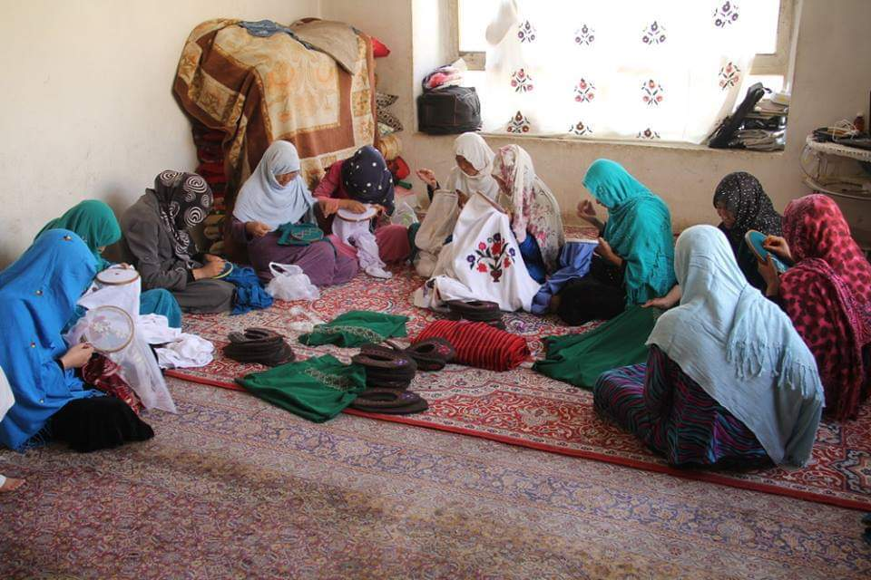

<html>
  <head>
    <title>{{ page.title }}</title>
    <meta name="viewport" content="width=device-width, initial-scale=1, shrink-to-fit=no">
    
    <meta charset="UTF-8">

    <link rel="stylesheet" href="https://maxcdn.bootstrapcdn.com/bootstrap/4.0.0/css/bootstrap.min.css" integrity="sha384-Gn5384xqQ1aoWXA+058RXPxPg6fy4IWvTNh0E263XmFcJlSAwiGgFAW/dAiS6JXm" crossorigin="anonymous">

    <link href="https://maxcdn.bootstrapcdn.com/font-awesome/4.7.0/css/font-awesome.min.css" rel="stylesheet">
    <link href="/css/theme.css" rel="stylesheet">
    <link href="/css/syntax.css" rel="stylesheet">

    <!-- Global Site Tag (gtag.js) - Google Analytics -->
    
    

    <!-- HTML5 Shim and Respond.js IE8 support of HTML5 elements and media queries -->
    <!-- WARNING: Respond.js doesn't work if you view the page via file:// -->
    <!--[if lt IE 9]>
      
      
    <![endif]-->

    

   <meta name="keywords" content="about,Firoz,Uzbek,Karimi,Faryab,university,Maimana,Faryab University, professor"/>

</head>

<body dir = "text-align:right;" style="padding-top: 30px;">

<nav style  = "" class="navbar navbar-toggleable-md navbar-expand-lg navbar-light bg-light">
  <button class="navbar-toggler navbar-toggler-right" type="button" data-toggle="collapse" data-target="#navbarNav" aria-controls="navbarNav" aria-expanded="false" aria-label="Toggle navigation">
    
  </button>
  <a class="navbar-brand" href="{{site.baseurl}}/">Faryab Women Handcrafts</a>
  

    <ul class="navbar-nav">
      <li class="nav-item active">
        <a class="nav-link" href="#">Home</a>
      </li> 
       <li class="nav-item">
        <a class="nav-link" href="index">Publications</a>
      </li>
      <li class="nav-item">
        <a class="nav-link" href="{{site.baseurl}}/teaching/">News</a>
      </li>
      <li class="nav-item">
        <a class="nav-link" href="{{site.baseurl}}/service/">Service</a>
      </li>
      <li class="nav-item">
        <a class="nav-link" href="{{site.baseurl}}/jobs/">Contact</a>
      </li>
    </ul>
  

</nav>

 <h4 style  = "text-align:center;margin:20px">سنائی دستی زنان فاریاب</h4>
               

        سنائی دستی زنان از دیر سال در کشور ما افغانستان به شکل متواتر از یک نسل به نسل دگر در حال تکثیر و ادامه میامد این فرهنگ کارکرد های زنان کشور ما را در سطح ملی و جهانی به نمایش گذاشته و نشان دهنده فرهنگ غنی کشور ما میباشد این صنعت که در بر گیرنده دست ساخت های مانند گیلم, واسکت, قرص دوزی, خامک دوزی, ادرم دوزی و آینه دوزی میباشد.
دستاورد های ساخته شده تپسط زنان افغان حتی در بیرون از کشور نیز عرضه شده در بسیاری کشور ها جایگاه خاص خود را دارد در ولایت فاریاب نیز زنان زیادی مشغول به این کار هستن و از این طریق زندگی خویش را به پیش میبیرند.

      

<small>&copy; Faryab Women Handcrafts &nbsp; | &nbsp; Last Update: {{ site.time | date_to_string }} &nbsp; | &nbsp; Web site code on <a href="https://github.com/karimi">Github</a> </small>

    
    
    
    

</body>
</html>
