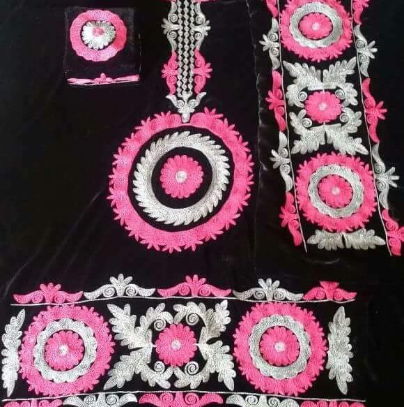

<html>
  <head>
    <title>{{ page.title }}</title>
    <meta name="viewport" content="width=device-width, initial-scale=1, shrink-to-fit=no">
    
    
  <meta charset="UTF-8">

  <link rel="stylesheet" href="https://maxcdn.bootstrapcdn.com/bootstrap/4.0.0/css/bootstrap.min.css" integrity="sha384-         Gn5384xqQ1aoWXA+058RXPxPg6fy4IWvTNh0E263XmFcJlSAwiGgFAW/dAiS6JXm" crossorigin="anonymous">

   <link href="https://maxcdn.bootstrapcdn.com/font-awesome/4.7.0/css/font-awesome.min.css" rel="stylesheet">
    <link href="/css/theme.css" rel="stylesheet">
    <link href="/css/syntax.css" rel="stylesheet">

<!-- Global Site Tag (gtag.js) - Google Analytics -->
    
    

    <!-- HTML5 Shim and Respond.js IE8 support of HTML5 elements and media queries -->
    <!-- WARNING: Respond.js doesn't work if you view the page via file:// -->

  <!--[if lt IE 9]>
   
   
      
    <![endif]-->
    

 <meta name="keywords" content="about,Firoz,Uzbek,Karimi,Faryab,university,Maimana,Faryab University, professor"/>
 
</head>

<body dir = "text-align:right;" style="padding-top: 30px;">

<nav class="navbar navbar-toggleable-md navbar-expand-lg navbar-light bg-light">
  <button class="navbar-toggler navbar-toggler-right" type="button" data-toggle="collapse" data-target="#navbarNav" aria-controls="navbarNav" aria-expanded="false" aria-label="Toggle navigation">
    
  </button>
  <a class="navbar-brand" href="/">Faryab Women Handcrafts</a>
  

    <ul class="navbar-nav">
      <li class="nav-item active">
        <a class="nav-link" href="home">Home</a>
      </li> 
      <li class="nav-item">
        <a class="nav-link" href="/publications/">Publications</a>
      </li>
      <li class="nav-item">
        <a class="nav-link" href="index">News</a>
      </li>
      <li class="nav-item">
        <a class="nav-link" href="/service/">Service</a>
      </li>
      <li class="nav-item">
        <a class="nav-link" href="/Contact/">Contact</a>
      </li>
    </ul>
  

</nav>

 
 <h4 style  = "text-align:center;margin:20px"><strong>زر دوزی</strong></h4>

   
   
   
  

   

  
   

       زر دوزی از چین به ایران راه یافته این نر به نام گلاباتون نیز یاد میشود که با گلاباتون دوخته میشود در گذشته تولیدش در بیشتر نقاط ایران رواج داشت اما حال در بندر لنگه بندر عباس و میناب از مراکز عمده تولید آن به حساب میاید
    
 
     

     

     
     
   

  <h4 style  = "text-align:center;"><strong>گراف دوزی</strong></h4>

   
   
   
  

   

  
   

        روی تور یا جالی دوخته میشود مواد استفاده شده مثل جالی نخ سوزن مردم هزاره زیادتر از این هنر استفاده میکند 
    
 
     

     
      

<small>&copy; Faryab Women Handcrafts &nbsp; | &nbsp; Last Update: {{ site.time | date_to_string }} &nbsp; | &nbsp; Web site code on <a href="https://github.com/karimi">Github</a> </small>

    
    
    
    

</body>
</html>
